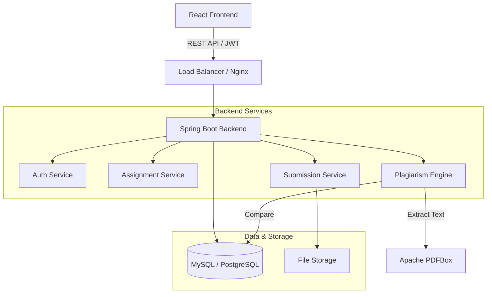

# Smart Assignment Submission System with Plagiarism Detection


A comprehensive, full-stack application designed to streamline assignment management for educational institutions. It features role-based access for students and teachers, with a robust, built-in plagiarism detection engine that analyzes submissions for originality using Cosine Similarity and N-gram analysis.

---

## 📖 Quick Links

| Document | Description |
|----------|-------------|
| [**🚀 Quick Start**](QUICKSTART.md) | Get the app running in under 5 minutes. |
| [**📘 Project Summary**](PROJECT_SUMMARY.md) | Detailed overview of features, architecture, and what has been built. |
| [**⚙️ Backend Setup**](BACKEND_SETUP.md) | In-depth guide for configuring the Spring Boot backend. |
| [**🎨 Frontend Setup**](FRONTEND_SETUP.md) | Instructions for setting up the React frontend. |
| [**🔌 API Documentation**](API_DOCUMENTATION.md) | Complete reference for all REST API endpoints. |
| [**🧪 Testing Guide**](TESTING_GUIDE.md) | How to run tests and verify system integrity. |

---

## 🏗️ System Architecture



---

## ✨ Key Features

### 👩‍🎓 For Students
*   **Secure Dashboard**: View assignments and track submission status.
*   **Multi-format Uploads**: Support for PDF, DOCX, and TXT files.
*   **Instant Feedback**: View grades and similarity reports once released.

### 👨‍🏫 For Teachers
*   **Assignment Management**: Create, edit, and manage deadlines easily.
*   **Automated Plagiarism Checks**: Instantly detect copied content across submissions.
*   **Detailed Reporting**: View similarity scores with highlighted text comparisons.
*   **Grading System**: Grade assignments and provide specific feedback.

### 🛡️ Security & Core
*   **JWT Authentication**: Stateless, secure access control.
*   **Role-Based Access**: Strict separation between Student, Teacher, and Admin data.
*   **Data Integrity**: Transaction-based operations to ensure consistent data states.

---

## 🛠️ Technology Stack

*   **Backend**: Java 17, Spring Boot 3.1.5, Spring Security, Spring Data JPA
*   **Frontend**: React 18, React Router, Axios, CSS3
*   **Database**: MySQL 8.0 (Compatible with PostgreSQL)
*   **Utilities**: Apache PDFBox (Text Extraction), JJWT (Security), Lombok
*   **DevOps**: Docker, Docker Compose

---

## 🚀 Getting Started

The fastest way to run the system is using Docker.

```bash
# Clone the repository
git clone https://github.com/vaishnavikharat22/Smart-Assignment-Submission-System-with-Plagiarism-Detection.git

# Navigate to the project root
cd assignment-plagiarism-system

# Start with Docker Compose
docker-compose up -d
```

Access the application:
*   **Frontend**: `http://localhost:3000`
*   **Backend**: `http://localhost:8080`

For manual installation instructions (without Docker), please refer to the [**Backend Setup**](BACKEND_SETUP.md) and [**Frontend Setup**](FRONTEND_SETUP.md) guides.

---

## 📄 License

This project is licensed under the [MIT License](LICENSE).
